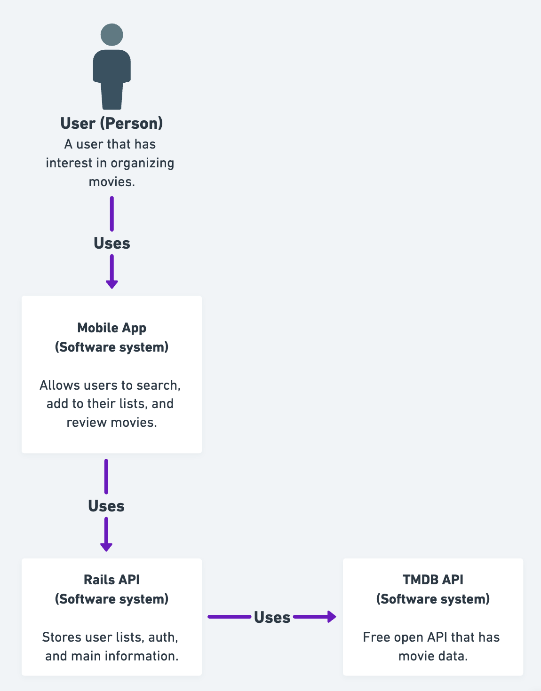
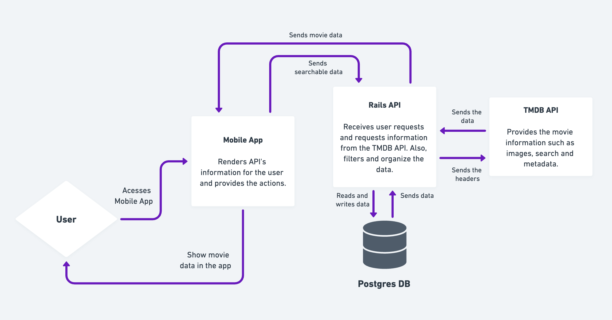
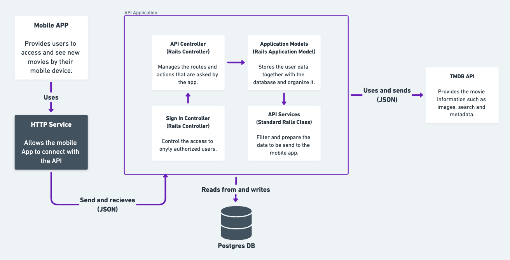
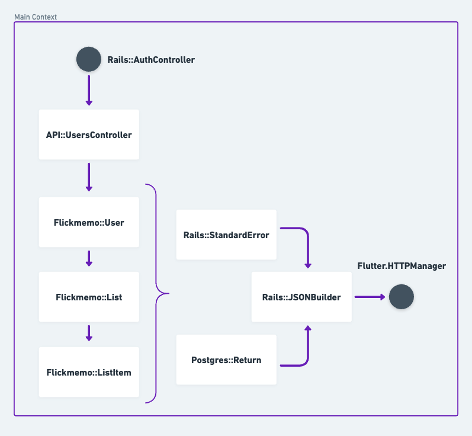
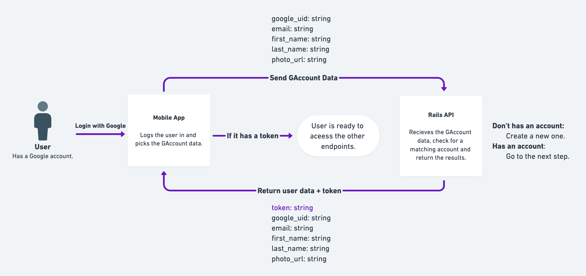

## Data Modeling

Here's some information about Flickmemo's data modeling. This session is being written, so some things may change.

### System Context

Below you can see more about the system context of the app:

  

### Container diagram

Here you check the container diagram of the app:

  

### Component diagram

Here you check the component diagram of the app:

  

### Code diagram

Here you check the code diagram of the app:

  

### API Auth diagram

Here you check how the API authentication works:

  

